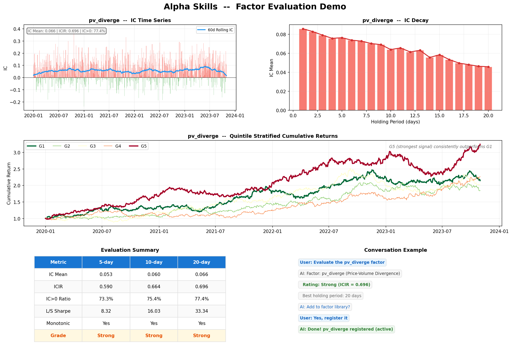

<h1 align="center">Alpha Skills</h1>

<p align="center">
<strong>Your AI-Powered Senior Quant Researcher.</strong><br>
<em>Discover alpha. Evaluate factors. Monitor decay. Backtest strategies.<br>All through natural language — in any AI coding assistant.</em>
</p>

<p align="center">
<a href="#quick-start">Quick Start</a> · <a href="#what-can-it-do">What Can It Do</a> · <a href="#multi-market">Multi-Market</a> · <a href="#skills-reference">Skills</a> · <a href="CONTRIBUTING.md">Contribute</a>
</p>

---

> **Hiring a quant researcher costs $300K/year. This one is free, open-source, and works 24/7.**
>
> Alpha Skills turns any AI coding assistant into a senior quantitative researcher. It discovers factors, evaluates them with institutional-grade methodology (IC/ICIR/quintile/robustness), monitors for alpha decay, and runs multi-factor backtests — all from a single sentence.
>
> **招一个量化研究员年薪百万。这个免费、开源、7×24小时工作。**



---

## What Can It Do

**You say one sentence. It does the rest.**

```
You:  "Evaluate the price-volume divergence factor"
AI:   📊 IC Mean=0.066 | ICIR=0.696 | Rating: ⭐ Strong
      Quintile spread monotonic. Best holding period: 20 days.
      Report saved → output/eval_pv_diverge.png

You:  "Mine 50 candidate factors and show me the best ones"
AI:   ⛏️ Scanned 50 candidates → 12 passed IC screen
      Top: PV divergence 20d (ICIR=0.70), Low downside vol (ICIR=0.53)...
      Register to library?

You:  "Backtest using my top 3 factors"
AI:   📈 Sharpe=0.74 | MaxDD=-13.9% | Profit Factor=2.24
      Gate check: ✓ PF>1 ✓ MDD>-25% ✗ Sharpe<1.0
```

No boilerplate. No notebooks. No 200 lines of pandas. Just results.

## Skills Reference

| Skill | What It Does | Try Saying |
|-------|-------------|------------|
| 🔍 **alpha-discover** | Design factors from natural language | "find me a low-volatility factor" |
| 📊 **alpha-evaluate** | IC / ICIR / quintile / long-short / robustness | "evaluate reversal_5" |
| ⛏️ **alpha-mine** | Auto-mine factor candidates, IC screen, rank | "mine 50 factors" |
| 📚 **alpha-library** | Register, list, search, retire factors (SQLite) | "show my factor library" |
| 📈 **alpha-backtest** | Single & multi-factor portfolio backtest | "backtest with pv_diverge + turnover" |
| 🏥 **alpha-monitor** | Detect IC decay, crowding, regime shift | "check factor health" |
| 📋 **alpha-report** | Panoramic, deep-dive, comparison reports | "generate factor report" |
| 📡 **alpha-signal** | Daily trading signal — target portfolio output | "today's signals" / "生成信号" |
| 🤖 **alpha-autopilot** | Autonomous loop: mine → evaluate → register → monitor → retire | "run autopilot" / "自动驾驶" |

<a id="quick-start"></a>
## Quick Start

### 1. Get the skills

```bash
git clone https://github.com/VernonOY/alpha-skills.git
```

### 2. Load into your AI assistant

| Platform | How |
|----------|-----|
| **Cursor** | Copy `skills/alpha-*/SKILL.md` → `.cursorrules` |
| **Windsurf** | Copy → `.windsurfrules` |
| **Claude Code** | `cp -r skills/alpha-* ~/.claude/skills/` |
| **Any LLM** | Paste SKILL.md as system prompt |

### 3. Install Python deps

```bash
pip install pandas numpy scipy matplotlib pyarrow
pip install tushare    # A-share
pip install yfinance   # US / HK
```

### 4. Talk to it

```
"evaluate the momentum_20 factor"
"mine volatility factors"
"backtest my top 3 factors, 2022 to 2025"
```

<a id="multi-market"></a>
## Multi-Market: A-Share · Hong Kong · US

Works out of the box for three markets. Auto-adapts trading rules per market:

| | A-share 🇨🇳 | Hong Kong 🇭🇰 | US 🇺🇸 |
|---|---|---|---|
| **Data** | Tushare Pro | Yahoo Finance | Yahoo Finance |
| **Price Limit** | ±10% | None | None |
| **T+N** | T+1 | T+0 | T+0 |
| **Cost** | 0.3% | 0.2% | 0.1% |
| **Benchmark** | CSI 300 | HSI | S&P 500 |
| **Pool** | 5000+ stocks | 78 HSI constituents | 143 S&P 500 |

Switch markets in one line:

```markdown
MARKET: US
DATA_MODULE: examples.us_data_yfinance
```

**Bring your own data.** Write a 7-function Python adapter for Bloomberg, AkShare, Binance, or any source — [see interface spec](examples/README.md).

## How It Works

```
┌─────────────────────────────────────────────┐
│           You (natural language)             │
├─────────────────────────────────────────────┤
│          AI Coding Assistant                │
│   (Cursor / Windsurf / Claude Code / ...)   │
├─────────────────────────────────────────────┤
│           Alpha Skills (7 SKILL.md)         │
│  discover · evaluate · mine · library       │
│  backtest · monitor · report                │
├─────────────────────────────────────────────┤
│     Python (pandas/numpy/scipy/matplotlib)  │
│     → factor computation                    │
│     → IC/ICIR/quintile evaluation           │
│     → portfolio backtesting                 │
│     → SQLite factor registry                │
├─────────────────────────────────────────────┤
│  Data: Tushare │ YFinance │ CSV │ Custom    │
└─────────────────────────────────────────────┘
```

**Zero framework dependency.** Each skill is a self-contained Markdown file. The AI reads it, writes the Python, runs it. Nothing to install except standard data science packages.

## Evaluation Pipeline

Your AI quant researcher doesn't just compute IC. It runs a **4-level institutional-grade evaluation**:

| Level | What | Speed |
|-------|------|-------|
| **L0** | Syntax + data validation | instant |
| **L1** | Quick IC screen (sampled 200 stocks × 2 years) | <30s |
| **L2** | Full: IC series, ICIR, quintile returns, long-short, monotonicity | 1-3 min |
| **L3** | Robustness: parameter perturbation, rolling window, start-date sensitivity | 5-15 min |

Plus optional **[qtype](https://github.com/VernonOY/qtype)** pre-flight — static analysis to catch look-ahead bias before you waste compute on fake alpha.

## Factor Mining Engine

`alpha-mine` systematically searches the factor expression space:

**3 mining strategies:**
- **Template-based** — momentum, mean-reversion, volatility, volume, composite templates × multiple window sizes
- **Combinatorial** — chain operators: `cs_rank(ts_corr(close, volume, 20))`
- **Mutation** — take a known strong factor, mutate parameters/operators

**Pipeline:** Generate 50+ candidates → IC quick screen → full evaluate top 10 → LLM judges economic intuition → present ranked results

**Overfitting guard:** Every surviving factor gets an **economic intuition score** (Strong / Moderate / Weak). Factors without a clear behavioral story are flagged as potential data mining.

## Built-in Factors (25+)

| Category | Factors |
|----------|---------|
| **Price-Volume** | momentum · reversal · volatility · pv_diverge · rsi · macd · bollinger · atr_ratio · turnover · abnormal_turnover |
| **Fundamental** | roe · roa · gross_margin · net_profit_growth · revenue_growth |
| **Valuation** | pe_ttm · pb · ps_ttm · dividend_yield · peg |
| **Composite** | quality_score · value_score · growth_momentum |

All gate checks and evaluation thresholds are **user-configurable**:

```markdown
GATE_SHARPE: 1.0
GATE_MAX_DRAWDOWN: -0.25
GATE_PROFIT_FACTOR: 1.0
EVAL_ICIR_STRONG: 0.5
```

## What's New

**v0.3 — Autopilot & Live Signals**
- `alpha-signal`: daily trading signal generator — outputs target portfolio from active factors
- `alpha-autopilot`: autonomous research loop — auto-mine, evaluate, register, monitor, retire
- Professional knowledge base: 6 expert-level reference documents (2,795 lines)

**v0.2 — Automated Factor Mining**
- `alpha-mine`: systematically search factor expression space, IC screen, economic intuition scoring
- All skills fully self-contained — zero external package dependencies
- Optional [qtype](https://github.com/VernonOY/qtype) pre-flight check

**v0.1 — Initial Release**
- 7 core skills · A-share/HK/US support · bilingual EN/ZH · multi-platform

## Roadmap

- [x] 9 skills (discover / evaluate / mine / library / backtest / monitor / report / signal / autopilot)
- [x] Daily signal generation (target portfolio output)
- [x] Autonomous research loop (mine → evaluate → register → monitor → retire)
- [x] Professional knowledge base (6 expert-level documents, 2,795 lines)
- [x] A-share, HK, and US market support
- [x] Market-aware trading rules
- [x] Automated factor mining (template + combinatorial + mutation)
- [x] Custom data source support
- [x] Multi-platform (Cursor, Windsurf, Claude Code, ChatGPT, local models)
- [x] [qtype](https://github.com/VernonOY/qtype) integration for static code checks
- [ ] Portfolio construction (factor → tradeable portfolio)
- [ ] Market regime detection & factor-regime mapping
- [ ] Factor crowding detection
- [ ] Web UI dashboard

## License

Apache 2.0

## Contributing

[See CONTRIBUTING.md](CONTRIBUTING.md) — add skills, data adapters, or improve methodology.

---

<p align="center">
<strong>Stop writing boilerplate. Start finding alpha.</strong><br>
<sub>Built by quants who got tired of copy-pasting the same IC calculation for the 500th time.</sub>
</p>
